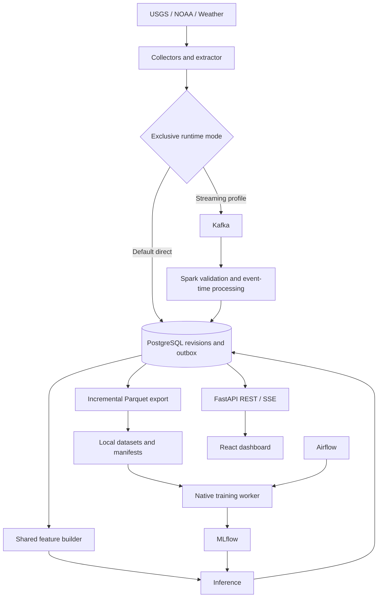

# HydroPulse — Complete Local Flood-Risk Forecasting Platform

## 1. Product, scope, and decisions

HydroPulse forecasts downstream river conditions, then converts those forecasts into threshold-exceedance estimates. Gauge height is the primary scientific and user-facing target. Discharge remains a separately trained secondary output, as requested. Headline horizons remain 1, 6, and 24 hours from forecast issuance; 48- and 72-hour forecasts are included in the detailed view and evaluation to test the value of upstream information on slower rivers.

Deliver the complete platform locally: historical and live river/weather ingestion, three basin deployments, baseline and PyTorch models, official-forecast comparisons, experiment tracking, scheduled training, dashboard, replay, event feed, monitoring, recovery, and reproducible documentation. Work begins with a functioning vertical slice rather than building every infrastructure component before exposing a prediction.

### Constraints

- Target the existing 24 GB Apple Silicon Mac. Docker allocation is at most 12 GB; actual steady-state service usage targets 8 GB or less. Native training is admitted only with sufficient memory headroom.
- Total project disk budget is 35 GB. Network-transfer volume is separate from retained storage.
- Entirely local deployment; all exposed services bind to localhost.
- No Redis, SeaweedFS, MinIO, cloud deployment, account system, email subscriptions, or Kubernetes.
- Kafka, Spark, Airflow, MLflow, PostgreSQL, FastAPI, React, and PyTorch remain complete deliverables. Kafka/Spark demonstrate streaming skills; the actual workload does not require them for throughput.
- Preserve the three featured basins. Do not silently expand to dozens of forecast targets or claim regional generalization from three targets.
- Full scope is fixed; implementation follows dependencies and evidence gates without delivery dates or effort estimates. Failed scientific claims are recorded; completing the software cannot manufacture predictive skill.

### Prediction semantics

For issuance time `t`, stage is `H(t+h)` and discharge is `Q(t+h)`. Flood risk concerns `P(max H(s) >= threshold, t < s <= t+h)`, not just the endpoint. Current observed flooding is a separate state.

Models issue hourly endpoint trajectories through 72 hours and separately predict maximum stage within 1/6/24/48/72 hours. Window-maximum labels are computed from native fifteen-minute observations so a brief crossing between hourly endpoints is not lost. A missing interval cannot certify a negative event label; a valid observed crossing can certify a positive label.

Stage means height above a station datum, not river depth. The map shows gauge risk and river connectivity, not inferred inundation polygons. NOAA forecasts and HydroPulse predictions remain visibly distinct.

## 2. Research status and data qualification gate

### Verified facts and limits

The original probes confirmed live metadata, primary instantaneous stage/discharge series, sample historical observations, and upstream navigation for the three targets below. A new probe also succeeded against the USGS v1 latest-continuous endpoint and the Cedar Rapids official forecast endpoint.

| Basin | Target | USGS ID | NWPS ID | Minor stage at initial inspection |
|---|---|---|---|---:|
| Cedar, Iowa | Cedar Rapids | 05464500 | CIDI4 | 12 ft |
| James, Virginia | Cartersville | 02035000 | CARV2 | 20 ft |
| Neuse, North Carolina | Goldsboro | 02089000 | GLDN7 | 18 ft |

These are source-versioned values, not permanent constants. [Cedar metadata](https://api.water.noaa.gov/nwps/v1/gauges/cidi4), [James metadata](https://api.water.noaa.gov/nwps/v1/gauges/carv2), [Neuse metadata](https://api.water.noaa.gov/nwps/v1/gauges/gldn7).

USGS confirms typical fifteen-minute recording with hourly transmission. The ordinary NWPS API lacks historical forecast archives, but IEM retains historical RFC text forecasts for retrospective operational comparisons. The NWPS HEFS and NWM APIs expose limited rolling history; the separate public Google national-water-model bucket provides historical operational NWM output, including a verified September 17, 2018 object. Archive completeness is audited per target, product, cycle and era. [S13–S14] AORC supplies long historical meteorological forcing. The USGS v1 endpoint is live and its migration requirements are documented. [S1–S4]

Compute episode counts from native-resolution stage before making statistical claims. Annual peaks locate candidate events but do not establish episode counts or duration. Validate resource budgets on the specified 24 GB host.

### Immediate archive and audit

The first implemented process archives USGS observations and each newly seen official RFC forecast before model work. The initial audit also inventories historical IEM RVF products and operational NWM objects; historical RFC baselines cover development and frozen-test dates where available. Save issue, generation, valid, and first-seen timestamps, source units, raw responses, and hashes. Poll official forecasts every fifteen minutes; unchanged payloads do not create new versions.

Fetch target stage history from 2007-10-01 through the latest complete UTC day. Generate coverage, datum-change, threshold-provenance, and flood-episode reports. Use the same audit on upstream candidates, but never require upstream gauges themselves to have official flood thresholds.

An episode starts on a valid threshold crossing and ends after 24 observed hours below the threshold. Merge episodes separated by less than 72 hours. Missing intervals make separation uncertain. For conservative cross-gauge counts, merge overlapping episode windows expanded by 72 hours into one storm cluster, even across basins; also report individual gauge episodes. Do not count adjacent forecast rows as independent floods.

Audit action/minor/moderate/major thresholds and training-defined 95th/99th-percentile stage levels separately. Percentile exceedance is labeled high water, not official flooding. Percentile thresholds and normalization are fitted on training data only.

### Split selection and probability gate

Freeze `archive_cutoff` at the last complete UTC day of the initial audit. The untouched final test is 2024-01-01 through `archive_cutoff`. Count test episodes for reporting, but do not move the boundary, select gauges, tune models, or calibrate using test outcomes. The subsequent period is prospective in time, but its scorecard ceases to be independent evaluation once it is inspected to tune models or operating rules. New independent claims require a new preregistered untouched evaluation interval.

The expected product path is stage forecasts with uncertainty and evidence status; official minor/moderate/major probabilities remain experimental because the three-basin record is expected to fail the calibration gates. Annual-peak exceedance years are a lower bound on episodes, not an upper bound; native-resolution auditing determines actual eligibility.

Use training through 2017, validation 2018–2020, and calibration 2021–2023 as the default development split. Only if the development audit shows enough independent events to satisfy the official gate, enumerate year-boundary splits with at least six training years, two validation years, and two calibration years. Select the latest calibration start satisfying the gate; among ties choose the latest qualifying validation start. Freeze the split, archive cutoff, benchmark sampling rules, and evaluation manifest at stage 1 exit, before modeling; stage 3 consumes that immutable manifest and cannot revise it using test results. Require per target at least 90% usable development stage data, and report seasonal coverage. Purge forecast labels crossing boundaries and prevent a storm cluster from straddling splits by excluding boundary-overlapping examples.

Minimum screening gate for a calibrated minor-stage output: 30 training, 10 validation, and 10 calibration independent storm clusters pooled across the three basins; additionally at least three training and three calibration episodes at each target that receives that claim. Require 10 independent test clusters before comparative flood-skill claims. These are conservative project screening thresholds, not a statistical guarantee; uncertainty intervals and reliability still decide whether a claim is justified.

The default delivery assumes the official-threshold gate does not pass. Do not fit a sparse official-threshold calibrator. Implement and test its eligibility logic, but do not make fitting such a calibrator a completion requirement. Publish stage forecasts and experimental exceedance estimates with `calibration_status=insufficient_events`, counts, and uncertainty diagnostics. Disable probability-triggered official flood alerts at unsupported thresholds. Observed flooding and predicted stage-threshold crossings still appear in the event feed with their distinct meanings.

Action-stage and percentile exceedance are the primary candidate risk products, each subject to its own evidence gate. If those also fail, the default remains stage plus interval and evidence status. Their success cannot be relabeled as minor-flood performance. Apply the same evidence policy independently to moderate/major categories. A direct classifier requires at least ten training storm clusters and both classes; otherwise use the stage-maximum distribution estimate without a fitted classifier. Three basins can deliver a valid platform and useful stage forecasts even if official flood-probability calibration fails.

This gate is completed before expensive weather backfills or neural experiments. Failed calibration does not block engineering work or justify silently changing the geographical scope.

## 3. Source ingestion and hydrology

### USGS v1 and revision handling

Use `https://api.waterdata.usgs.gov/ogcapi/v1/` for monitoring locations, time-series metadata, continuous, and latest-continuous collections. Adapt to v1 metadata schema changes rather than merely replacing the URL. Select primary instantaneous series explicitly: parameter 00065 for stage, 00060 for discharge. Annual peaks and daily series cannot substitute for instantaneous labels. [S2]

Poll every five minutes. Use latest-continuous for discovery, then fetch the overlapping continuous interval so hourly telemetry bursts do not lose intermediate fifteen-minute samples. Maintain per-series watermarks, reconcile the preceding six hours every fifteen minutes, preceding thirty days nightly, and older partitions monthly. Historical queries are resumable monthly pages with bounded concurrency, jitter, rate limiting, and Retry-After handling.

Observation identity is `(source, time_series_id, event_time)`. Revision identity also includes source modification time and content hash. Preserve `first_seen_at`, `ingested_at`, source modification, approval status, qualifiers, raw units, and normalized value. A correction at the same observation time is a valid revision. Source nulls/sentinels are not zero; extreme floods are not clipped merely for being outliers.

### Thresholds, topology, and regulation

Refresh NWPS metadata daily. Preserve threshold versions, units, datums, `upstreamLid`, `downstreamLid`, `forecastReliability`, `reachId`, and source links. Match NOAA/USGS identities, compare overlapping stage values, and check reference thresholds. Unexplained datum offsets suppress threshold products, not raw observation display. A historical current-threshold analysis is explicitly different from historical official classification.

Use NLDI topology and basin polygons; NOAA upstream/downstream identifiers are cross-checks, not a replacement for full hydrologic connectivity. Discover within 300 river kilometers, expanding once to 600 if fewer than three suitable upstream gauges are found. Select at most eight upstream gauges per target, prioritizing valid connected mainstem and separate tributary coverage, then development completeness, overlapping history, and distance. Tie-break on station ID. Require at least three suitable upstream inputs per target; preserve a report if that condition fails. Do not infer links from map proximity. [S5]

Use station-specific lag sweeps through 72 hours using training folds only. Store selected topology and lags in the model manifest.

For the Neuse, include USGS 02087183, “NEUSE RIVER NEAR FALLS, NC,” as a candidate downstream-of-dam flow proxy, subject to connectivity and coverage verification. This station's identity was verified through v1. Add observed reservoir level/release data when a documented historical/live source passes the same availability audit. A downstream gauge is a measured release proxy, not a known future operating schedule; never invent future dam releases. Include regulation metadata, proxy age, and release-change features, and evaluate regulated episodes separately. When future releases are unknown, the model card states that limitation.

### Meteorological inputs and source shift

Implement three adapters behind a common weather contract: AORC historical forcing, MRMS historical/live precipitation, and HRRR archived/live numerical weather forecasts. The contract contains provider/version, issue time, valid interval, first-seen time or assumed availability, variable, unit, basin aggregation, and coverage. Future provider changes use this interface; an announced RRFS transition is not a reason to substitute untested data. [S4, S6, S7]

- AORC: retrieve precipitation and temperature from available Zarr years overlapping 2007 onward. A read-only S3 listing on September 14, 2026 confirmed yearly stores from 1979 through 2025; validate actual basin/time coverage and checksums rather than treating a store name as complete data. NOAA also documents regeneration for incorrectly masked rows, so pin object versions/checksums and preserve missingness. Use basin bounding windows and cached area-weighted cell masks. Reanalysis is a retrospective forcing product, not historically available live input.
- MRMS: use hourly MultiSensor QPE Pass2 from its available archive and live feed. Fetch each compressed GRIB file whole, stream/decompress, aggregate all selected basins in one pass, then evict the temporary grid. GRIB byte-range extraction does not apply to these gzip files.
- HRRR: use `.idx` records and byte-range requests for precipitation and temperature. Read accumulation intervals explicitly. Historical cycles have different versions and lead coverage; never assume the modern extended lead time existed throughout the archive. Mask unavailable leads. Initially qualify 2014 onward, downloading only cycle/lead records needed for the selected training samples.

Use the approximately October 2020–December 2025 AORC/MRMS overlap explicitly. For the untouched 2024–2025 test subset, preregister paired evaluation of the same frozen model and identical examples under AORC and MRMS inputs, reporting both the within-model source substitution effect and the operational model comparison. Perform all adjustment fitting on development data only; availability assumptions remain separate because AORC is retrospective. The 2026 test portion uses only sources actually available for that period, without invented AORC coverage.

Keep long-history AORC models and operational MRMS variants identifiable. On overlapping development years, measure seasonal/basin bias and extremes before fitting any source adjustment. Fit adjustment on training folds only, show raw and adjusted ablations, and evaluate the operational MRMS input distribution separately. AORC supplies older flood-weather examples; it does not erase domain shift or make operational claims possible by itself.

Train explicit no-NWP and NWP variants. Serve 48/72-hour outputs exclusively from the no-NWP bundle, even when a NWP bundle supplies shorter horizons; expose the horizon-to-model mapping so shared decoder inputs cannot silently introduce HRRR into the long-horizon ablation. Retain old flood episodes even if HRRR was unavailable. Weather-enhanced forecasts use the newest complete cycle known at issuance; unavailable future leads receive masks, never synthetic zero rainfall. The 48/72-hour models use gauge history plus observed precipitation only, with no future HRRR inputs. Restrict the future-weather ablation to 1/6/24 hours with sufficient cycle coverage. HRRR’s maximum nominal 48-hour lead is measured from initialization, so it cannot cover 48 hours after a later issuance time, let alone 72 hours. Do not claim a medium-range future-weather experiment; no GFS adapter is added to scope.

Initial retrospective availability assumptions: USGS hourly transmission with sampled phase plus 5–15 minutes processing; MRMS Pass2 two hours; HRRR three hours after initialization. Run sensitivity scenarios, including larger USGS delays and missing telemetry bursts. These are assumptions, replaced by first-seen logs prospectively. Archive object LastModified is not proof of original release time.

### Transfer and storage budget

Run a seven-day, all-basin extraction benchmark before full weather ingestion. Measure bytes, requests, wall time, CPU, and retained feature size; extrapolate each source separately. Backfills use four HTTP requests maximum in flight, one grid decoder, a 2 GB temporary cache, and resumable manifests. Extract once per source object for every basin.

The preliminary transfer allowances of 40–50 GB MRMS and 300 GB HRRR require validation with the extraction benchmark. At 20 Mbps, 350 GB alone requires about 39 transfer hours; at 100 Mbps about 8 hours, before request/decoding overhead. Use the measured benchmark to display transfer progress and resource usage; do not attach a delivery deadline to acquisition. Bounded local storage does not imply bounded total download volume.

## 4. Architecture and operational state

### Complete stack

Python 3.12/uv/Pydantic; PostgreSQL/SQLAlchemy/Alembic; local Parquet/PyArrow/DuckDB; Kafka KRaft; Spark Structured Streaming; Airflow LocalExecutor; MLflow with PostgreSQL tracking and local artifacts; PyTorch/XGBoost/scikit-learn; FastAPI; React/TypeScript/Vite/MapLibre/ECharts; Prometheus/Grafana; Docker Compose; native Mac training worker.

Pin compatible supported dependency versions and image digests. Verify ARM64 images and Spark connector compatibility in setup. No S3 emulation is necessary for Spark or MLflow. Use mounted filesystem paths inside containers and configured host paths for the native worker; store artifact URIs relative to the managed artifact root.

The direct adapter is the default for development, ordinary tests, and steady-state operation: collectors call the canonical PostgreSQL ingestion transaction. `make start PROFILE=streaming` enables the fully implemented Docker Compose streaming profile, inserting Kafka/Spark before that same transaction. Use identical feature/model/storage contracts and parity fixtures. Ingestion mode is exclusive per run; switching modes resumes from durable watermarks with idempotent deduplication, rather than running both ingestion adapters concurrently. Kafka/Spark remains a complete tested deliverable, not a placeholder. Run the streaming demo and seven-day soak using this profile; also run direct-mode acceptance and recovery checks.

### Kafka and Spark scope

The expected live gauge workload is approximately 5,000 observations/day, before revisions/weather. Use one KRaft broker, one partition per topic, and one streaming consumer. Topics are observations, weather, forecasts, risk-events, and dead-letter, with replay-specific prefixes. Gauge IDs remain keys. Retention is seven days capped at 1 GB; Parquet/PostgreSQL hold durable history.

Use five-minute Spark micro-batches and a two-hour watermark for bounded operational state. Preserve every valid revision through an unwatermarked ingestion path; the watermark applies to live aggregates, not whether late data is retained. Old corrections update canonical history and schedule reconciliation without rewriting issued forecasts.

Spark's sole mandatory durable sink is an idempotent PostgreSQL transaction. Store revision, canonical update, processed batch marker, and outbox record atomically. Deterministic event IDs handle retries. A separate exporter creates Parquet from durable records. This eliminates the custom distributed multi-sink commit protocol. Spark foreachBatch itself is at-least-once; document the application's deduplication guarantees. [S8]

### PostgreSQL and filesystem ownership

PostgreSQL stores station/threshold/topology metadata, raw revision payloads, recent canonical observations, feature snapshots, forecasts, official forecasts, event history, evaluations, batch/outbox markers, and typed jobs. Retain 90 days of observations online; export older observations before removal. Forecast metadata stays online; bulk trajectories are archived after 90 days with manifests.

Feature snapshot key: `(target, issuance_time, source_revision_fingerprint, feature_version, mode, replay_run_id)`. Forecasts refer to immutable snapshot/model/threshold IDs. A latest-forecast pointer changes transactionally only after a complete forecast is stored.

The exporter writes temporary files, fsyncs, atomically renames, then commits a checksummed manifest. A crash before manifest commit leaves a recoverable orphan; a retry reuses deterministic content identity. Daily compaction publishes a new manifest before removing superseded files. Never drop database source rows until the export is verified.

Use PostgreSQL LISTEN/NOTIFY for FastAPI SSE wakeups. Notifications contain identifiers only and are not durable. A persisted event sequence supports reconnect/catch-up, with periodic database checks to recover missed notifications. PostgreSQL replaces all former Redis responsibilities; no cache service remains.

## 5. Telemetry-aware forecasting and model design

### Issuance and freshness

Issue on a fixed hourly schedule and when a new target observation batch arrives, coalescing triggers within five minutes. Recompute on significant source corrections without claiming a new independent observation. All horizons are relative to `issued_at`, not to the last gauge sample. Do not shift the user's “next hour” backward because telemetry is old.

Target observation age: up to 90 minutes is within the default supported telemetry range; 90–120 minutes is degraded; over 120 minutes suppresses a new forecast. Always display actual age. Collect station latency distributions; a versioned station policy can tighten these defaults only after availability-aware validation.

Build 168 hourly lookback steps plus latest subhour observations, slopes, masks, and ages. Do not fill the telemetry gap with fictitious measured stages. Train the same missing-tail patterns seen in service. Retain native fifteen-minute data for label maxima and event verification.

### Stage-first models

1. Persistence and damped trend endpoints; window maxima implied by their trajectories.
2. Per-target direct XGBoost endpoint regressors at 1/6/24/48/72 hours and stage quantiles at 0.05/0.10/0.25/0.50/0.75/0.90/0.95.
3. Per-target direct maximum-stage regressors/distribution models at the same horizons. Their labels use all valid native samples within each window.
4. Direct XGBoost classifiers for action/minor/moderate/major and percentile exceedance only where training gates pass.
5. Per-target PyTorch GRU with target-only, upstream, and upstream-plus-weather ablations. Two layers, hidden size 64, dropout 0.1, 168 hourly inputs, direct 72-hour quantile outputs and direct window-maximum outputs. AdamW at 1e-3, gradient clipping 1, early stopping patience 10, maximum 100 epochs, batch size 64 reduced for memory. Train three seeds for final comparisons.
6. A sampled autoregressive GRU trajectory experiment is implemented after direct models, with the same data/split contracts. It is a challenger, not a prerequisite for a functioning risk product.

Select checkpoints using validation stage MAE across 1/6/24 hours with equal horizon weights; use pinball loss as tie-breaker. Include 48/72-hour skill in the report without allowing it to conceal a headline-horizon regression. No shared target embedding is required for three targets. Do not present this as ungauged-basin learning.

For risk-from-stage estimates, fit a conditional distribution of each window's maximum stage using a GRU location/scale Student-t head (degrees of freedom constrained above two) and compare with the direct quantile/XGBoost models. Derive `1 - CDF(threshold)` from this fitted maximum-stage distribution, not from three endpoint quantiles or independent hourly probabilities. Label distribution extrapolation at rare thresholds. Evaluate calibration even when negative log-likelihood is good.

Keep direct classifiers as challengers to the derived estimates. Choose the probability product on independent validation performance only when its event gate passes. All probability outputs identify `method` and `calibration_status`. Stage remains available even if no probability model qualifies.

### Discharge and ratings

Keep a separate direct discharge XGBoost model and a separately trained GRU using log1p discharge. Discharge training cannot change stage weights or promotion decisions. Expose stage-to-discharge conversion as an additional comparator only where a documented, applicable rating curve exists. Version ratings and reject extrapolation beyond their valid range. A current NOAA rating curve does not establish a historically valid mapping, and backwater/regulation can make simple conversion misleading. This preserves the explicit requirement to predict both variables while making stage primary.

### Calibration and uncertainty

Default calibration candidate is regularized sigmoid calibration on the independent calibration block, only after event gates pass. Isotonic is an additional candidate only with at least 50 independent calibration storm clusters and 1,000 labeled examples; select it using blocked inner validation. Raw class weighting changes probability interpretation and must be corrected/calibrated on the natural prevalence. [S9]

Project outputs to satisfy horizon monotonicity and threshold ordering. Evaluate and document the full postprocessed pipeline, not only raw model calibration. Quantile crossing is corrected before scoring. A single shared calibrator is not assumed valid across targets or thresholds.

Use storm/block-bootstrap ensembles for uncertainty in risk estimates where the data support resampling, and report performance confidence intervals. Do not use a binomial interval over 1,000 model samples as if it represented model uncertainty. With insufficient events, show numerical estimates only in the experimental detail panel alongside counts and model spread; the headline is stage plus its interval and evidence status.

## 6. Evaluation, official comparisons, and promotion

### Historical RFC forecasts: development and frozen test

Implement an IEM AFOS archive adapter alongside the live NWPS collector. Historical official comparisons are part of the frozen 2024–archive_cutoff test and the available development period, not restricted to future observations. Audit target-bearing records, not just product presence. [S13]

| Target | IEM AFOS product | Initial verified record |
|---|---|---|
| CIDI4 | RVFCIW | June 28, 2024 14:46Z: six-hourly forecast stage and 14.1 ft crest; a June 1, 2010 product listing also returned a record |
| CARV2 | RVFJAA | June 28, 2024 14:11Z product contains a CARV2 stage forecast |
| GLDN7 | RVFRAH | June 28, 2024 12:34Z product contains a GLDN7 stage forecast |

Use IEM `/api/1/nws/afos/list.json` to discover products by identifier/date and `/api/1/nwstext/{product_id}` to obtain original text. Paginate/chunk supported queries, retry with backoff, and retain product IDs, raw text, hashes, archive metadata, parser version, and retrieval time. Audit coverage from the development start through archive_cutoff; do not assume sampled records establish continuous coverage or a uniform issuance frequency. Record missing and unparseable target forecasts explicitly. Stage 1 produces a target-by-calendar-month coverage table with total product count, target-bearing forecast count, successfully parsed issuances, first-lead and issuance-spacing distributions, available valid points, and eligible matched pairs for each comparison protocol. Distinguish a month with no archived products from products that omit the target and parser failures. Do not fill missing months or infer station coverage from product frequency. Show matched pair count, distinct issuance count, independent event count where applicable, and coverage/exclusion counts beside every official-comparison metric, including zero-coverage cells. The previously reported monthly counts are audit cases to reproduce, not constants to assume.

SHEF parsing is a tested component: support `.E`/`.ER` sequences and continuation records, `.A`/`.AR` crest records, `DC` creation time, `DH` valid-time anchors, `DIH06`/`DIH6` increments, parameter codes such as `HGIFF`, `HGIFFZZ`, and `HGIFFX`, units, missing values, revisions, and month/year rollover. Honor the SHEF time-zone code and its documented daylight-time rules; the verified Goldsboro sample uses `E` while Cedar/James examples use `Z`. Distinguish observations from forecast stage and forecast precipitation. Unknown constructs go to a parse-error report rather than silently becoming values. Freeze parser fixtures and version before scoring the final test.

Store `product_issued_at`, `shef_created_at`, `valid_at`, `iem_entered_at` (the list.json `entered` field verbatim), `archive_timestamp`, `retrieved_at`, `availability_basis`, and, only for actual live collection, `first_seen_at`. Treat `entered` as an archive product timestamp of unconfirmed receipt semantics: matching the WMO header minute does not establish a receipt time. Stage 1 records a timestamp-semantics audit against IEM-maintained documentation or ingestion source code; receipt status stays unconfirmed if that evidence does not resolve it. Do not label `entered` as a verified receipt timestamp by default. Any later maintainer clarification is archived as provenance rather than silently changing the frozen protocol. For the operational protocol below, historical eligibility uses the latest of product issuance, SHEF creation and a receipt timestamp only when independently verified, plus a 15-minute assumed dissemination allowance when receipt is unknown; report 0/30/60-minute sensitivity. Never substitute present-day download time or an archive migration time for historical publication. Corrections retain their own availability; a corrected product cannot replace what would have been available at an earlier issuance.

Continue immediate live NWPS archiving as the higher-fidelity first-seen source. In overlap, retain both archives and cross-check parsed values; prefer live first-seen records for actual operational evaluations. Official forecasts carry RFC- and era-specific QPF assumptions: preserve forecast text/context when present and stratify by RFC/era, treating undocumented assumptions as unknown. Official forecast values remain benchmark outputs, not model inputs in these experiments.

### RFC comparison protocols

Keep two experiments separate in the API, metric tables, and frozen evaluation manifest; their samples and interpretations cannot be pooled.

**Matched-issuance skill test.** For each eligible target-bearing RFC forecast, run the frozen HydroPulse model retrospectively at the target series’ SHEF `DC` creation time. Anchor all HydroPulse horizons and the causal input cutoff to that exact time, including minute offsets, and apply the frozen source-availability policies. No measurement or weather cycle arriving afterward can enter HydroPulse. Score both forecasts against the same observed truth at the RFC’s original valid times within HydroPulse’s 72-hour coverage (for example, roughly creation +3h, +9h, +15h). Interpolate HydroPulse’s own hourly endpoint predictions between bracketing model-output points when an official valid time falls between them; record this flag. Do not interpolate the RFC sequence for this primary experiment, extrapolate either model, or use its crest as an extra regular forecast point. Report actual lead times and preregistered lead bins, with per-target/month sample counts.

This matches forecast creation time and evaluation truth, not a provably identical information set: internal RFC observation cutoffs and QPF assumptions may be undocumented. Describe the result as creation-time-aligned skill under HydroPulse’s stated availability assumptions, not an equal-input experiment. A missing/invalid `DC` excludes the record from this protocol. A correction uses its own creation time; exclude corrections with unresolved timing. This experiment reconstructs forecasts at creation time and does not claim they were publicly disseminated at that instant, so the operational publication-lag rule is not imposed on the paired RFC product itself.

**Operational comparison.** At every normal HydroPulse issuance, select the latest RFC forecast eligible under the archive/live availability rules. Score common valid times and requested headline horizons only where that same issued RFC series supplies either an exact point or two bracketing points. Interpolate official values only inside those brackets, never before its first point or after its last. Show RFC creation age, assumed or measured availability lag, actual valid time, interpolation flags, and coverage. This answers what a user could compare at that moment, and allows the official forecast to be older than HydroPulse.

Headline RFC skill comparisons target 24 hours and beyond when covered. Do not promise meaningful matched-issuance +1h/+6h comparisons: a first official point several hours after creation and six-hour spacing leave +1h unbracketed and +6h coverage dependent on the actual series. Audit the real coverage instead of hardcoding a percentage. Operational +1h/+6h diagnostics can sometimes bracket an older RFC forecast, but are not evidence of a fresh same-age short-horizon skill comparison; label and keep them separate. HydroPulse’s 1h/6h evaluation against persistence, XGBoost, and observed truth remains intact.

Score declared crest forecasts separately at their specified valid time/window. Six-hourly RFC points cannot establish every native-resolution within-window crossing. Missing official forecasts do not count as model wins. For both protocols, suppress a metric when there are no matched pairs rather than display zero error.

### Historical operational NWM discharge benchmark

This benchmark evaluates HydroPulse’s secondary discharge model only. NWM supplies discharge, not stage; it does not validate the primary stage model or flood-risk probabilities.

Use anonymous HTTPS access to Google's `national-water-model` bucket; no account, billing project, or BigQuery dependency is required. Operational objects were directly listed for September 17, 2018 and June 28, 2024. A sampled 2024 short-range channel_rt object was 13,572,995 bytes. This archive is distinct from the short rolling history exposed by the NWPS API. [S14]

Read actual forecast reference/valid times and product configuration from NetCDF metadata; map each target to its reach ID using version-appropriate metadata. Preserve object generation/checksum, configuration, member, reach, model version, and creation/publication metadata. Stratify across NWM version boundaries, including v2.0, v2.1 and v3.0; derive exact boundaries from source metadata/release records. Do not assume constant reach indexing or array order across versions. Historical availability requires the cycle's publication time or a declared lag proxy; initialization time alone is insufficient. Use a two-hour initial lag assumption where publication evidence is absent, with one/three-hour sensitivity, separate from actual live first-seen evaluation.

Bound extraction with a preregistered sampling manifest: select 00/06/12/18 UTC cycles in the union of ±7-day windows around audited test-period minor-flood episodes; add the first seven UTC days of each calendar quarter within the test interval as a fixed background sample. Deduplicate windows and extract all three target reaches from each downloaded object. Apply the same rule to eligible development dates from the available operational archive. Event-window selection is evaluation stratification, not model training; report event and fixed-calendar scores separately, never as an unbiased whole-period metric. Do not expand or shrink windows based on model performance. Restrict this sampled comparison to paired discharge MAE, RMSE and signed bias on identical gauge/issuance/valid-time pairs, reported separately by event and fixed-calendar strata. Exclude false-alarm ratio, episode recall, warning lead-time, precision/recall and other flood-classification claims for both NWM and HydroPulse from this sampled comparison. Observed-event sampling misses many unmaterialized forecast events; background sampling does not repair that selection bias. Do not convert sampled discharge to stage or pool the strata into a purported whole-period score. HydroPulse’s full-period flood evaluation uses its separate complete evaluation population.

Use short-range output for +1/+6h where supported; use deterministic medium-range member 1 for +24/+48/+72h where configuration coverage exists. Compute required lead from HydroPulse issuance relative to the selected available NWM cycle, fetching bracketing forecast leads when necessary. Do not invent a +24h short-range forecast or confuse medium-range members with short-range output. Report product/member/lead coverage for every comparison.

Stream one NetCDF object at a time through the existing 2 GB temporary cache, extract selected reach values, then evict full files. Default to verified whole-object reads; benchmark kerchunk/range-based reads as an optimization only when chunk layout yields actual transfer savings and values match whole-file extraction. Do not assume selecting three reaches downloads three values from a compressed continental chunk. Full short-range ingestion can approach 5.9 GB/day; the sampled request/byte estimate is generated before downloading and includes medium-range objects. The 35 GB retained-storage limit still applies, while cumulative transfer may be tens of GB or more depending on episode count and configuration.

### Benchmark classes and reporting

The frozen report includes separate creation-time-aligned and operational RFC stage comparisons, with matched counts beside each metric, and sampled historical operational NWM paired discharge-error comparisons only, alongside model baselines and paired AORC/MRMS tests. Archive gaps reduce matched sample counts and are visible in the coverage report; they do not change the frozen test boundary. Statistical skill claims still obey episode-count gates.

Keep three classes separate: archived operational RFC/NWM forecasts, actual prospectively captured forecasts, and NWM v3 retrospective simulation. The retrospective simulation is a forcing-driven reference, not a forecast issued at each historical time. HEFS collection remains included where available, without treating its current ten-day API window as a multi-year archive. [S3, S10]

### Metrics and question order

For the full-period HydroPulse flood evaluation, lead with episode recall, false-alarm ratio, first-warning lead time, missed episodes, and uncertainty based on independent storms. Then show PR-AUC, reliability, and Brier scores; include climatology and always-no-flood references. Report performance among issuance times below threshold separately from forecasts made during existing floods.

For stage, report MAE/RMSE, high-stage MAE, pinball loss, interval coverage/width, window-maximum error, and peak timing. For discharge, report cfs errors separately. Stratify by target, horizon, input/weather mode, season, observation age, regulation proxy, and source regime. Do not report CRPS from a handful of quantiles without declaring the approximation.

The final report answers: does HydroPulse beat persistence; does upstream/weather improve stage; does the neural model improve on XGBoost; does it add skill versus contemporaneous official forecasts; and where is flood-risk evidence insufficient? No improvement is assumed. [S11]

### Retraining and holdout policy

Freeze the initial research release before opening the final test. Save an immutable report and model bundle. The test is used once for that release's claims. An operational model may subsequently train on those dates, but it then cannot claim those dates as unseen; its scorecard is prospective.

Airflow schedules monthly candidates, plus an event-triggered candidate after five new independent flood clusters, with a minimum 30-day interval. Do not retrain weekly by default.

For each candidate, reserve the most recent 90 days before its cutoff for chronological stage promotion evaluation and exclude those labels from fitting. Evaluate probability promotion on the latest 365-day held-out block only if it contains at least ten independent relevant clusters; the risk candidate must exclude that full block from fitting. Stage and probability bundle versions can differ and are exposed in the response.

Promotion requires schema/data compatibility, finite inference, no more than 5% stage-MAE degradation at any headline horizon, at least 2% mean headline stage-MAE improvement, and no deterioration in high-stage MAE beyond 5%. Near-zero denominators use a 0.01 ft floor. After 90 days without stage-model promotion, allow a refresh candidate without the 2% improvement requirement if it is non-inferior: the one-sided 95% paired block-bootstrap upper bound on candidate-minus-champion MAE is no greater than max(0.01 ft, 1% of champion MAE) at every headline horizon, with the existing high-stage, compatibility, and shadow checks still passing. Age alone never promotes a degraded or unsupported model; if none qualify, retain the champion and expose a refresh-needed status. A candidate that fails stays a candidate. Probability promotion additionally requires adequate events and nondegrading event recall/false-alarm ratio and Brier score under the complete postprocessing. Otherwise retain the previous risk model; do not treat no events as a pass.

Run seven days in shadow before promotion. Use MLflow candidate/champion/previous aliases resolved to immutable versions. Roll back the whole affected model bundle, including scalers, calibration, feature schema, and provenance. Repeated operational selection is not an independent research test. Label the prospective dashboard scorecard as operational/adaptive evaluation once developers tune against it; being collected after go-live does not preserve independence.

## 7. Product and interfaces

### API

Use `/api/v1`: GET basins, gauges, gauge detail, observations, latest forecast, forecast by ID, official forecasts, risk-events, models, verification, system/status, and events/stream. Bound history ranges and paginate. Generate TypeScript clients from OpenAPI.

Forecast contracts include forecast/target IDs; issued_at; newest observation time and age; available-data cutoff; immutable input snapshot; stage and discharge model versions; weather provider/cycle/coverage; threshold/rating versions; endpoint quantiles; maximum-stage summaries; probabilities with method/evidence status; mode/replay ID; and degradation reasons. Null means unavailable, not zero. Expose 48/72-hour outputs as detailed horizons, with the same missing-input rules.

Local operator endpoints create typed replay/training jobs and request promotions. Protect with a generated local token. Workers claim typed jobs through the API, heartbeat, checkpoint, and never execute user-supplied shell commands.

### Dashboard delivery by implementation stage

The first vertical slice delivers overview and gauge views. Replay, model report and operations views are completed in stage 6; intermediate work can expose partial versions without marking them complete.

- Overview: basin selector, bundled river graph/map, stage with uncertainty interval and evidence status by default, trend, source age, headline horizons, local watchlist, event feed. Show eligible action-stage/high-water products separately; official flood probabilities default to the experimental detail panel.
- Gauge: observed history, hourly prediction bands, native-resolution historical maxima, official forecast overlay, stage/discharge toggle, peak/window maxima, upstream and rainfall context, source/model versions.
- Replay: real historical episode, pause/seek/speed, issuance-time data restrictions, separately timed observed truth, explicit retrospective versus availability-simulated mode.
- Model report: baseline/official comparisons, event counts, calibration status, intervals, upstream/weather/source-shift ablations, immutable research report.
- Operations: collectors, lag, training, weather completeness, memory/disk, verification, failures and maintenance.

Keep usable keyboard focus, readable charts, and a responsive layout, but avoid an extensive design system or exhaustive browser matrix. Browser tests cover the core forecast/replay flows. Bundled geometry and assets allow replay without external map tiles.

### Event semantics

Maintain separate observed flooding, predicted stage crossing, and validated probability risk event types. An experimental probability cannot trigger a validated risk event. Default probability opening threshold is 50% and resolution threshold 30%, subject to the calibration gate; these are application settings, not official warning criteria.

Two distinct target observation batches above opening threshold open an event; three distinct batches below resolution threshold close it only if observed stage is below threshold. Repeated polls, revisions, and weather-only reruns do not increment confirmation counters. One valid observed crossing opens observed flooding immediately. Predicted median maximum crossing creates a separately labeled model-stage event. Stale input marks events unknown/stale rather than resolving them. Persist all transitions, forecast references, and source fingerprints.

Replay has separate topic prefix, database namespace/run ID, files, and event counters. Seeking resets that replay's derived state and replays from a checkpoint; live state is unaffected.

## 8. Local operation and resource controls

`make bootstrap` checks ARM64 dependencies, disk, Docker resources, and local credentials. `make start` starts the direct-mode Compose services and native worker; `make start PROFILE=streaming` additionally starts Kafka/Spark and selects streaming ingestion; `make stop`, `make status`, `make replay`, `make backup`, and `make restore` expose the complete lifecycle. No cloud account is needed. The application is at localhost:8080.

Target service allocations: Kafka 0.75 GB, Spark 1.5 GB, Airflow 1.5 GB, PostgreSQL 1 GB, API/inference/MLflow/collectors 1.75 GB, monitoring 0.5 GB, plus headroom. These are budgets requiring measurement. Native training targets 3 GB, one job at a time, with MPS tested on real forward/backward steps; CPU fallback is supported. Pause bulk weather/backfill work during training. Admit training only when at least 6 GB host headroom is available and macOS memory pressure is normal. Abort/checkpoint on sustained pressure instead of relying on unlimited swap. Keep live serving running. [S12]

Disk budget: images/environments 9 GB; canonical data/weather features 8 GB; database/Kafka/checkpoints 5 GB; models/replay 4 GB; temporary extraction 2 GB; rotating local backups/logs 3 GB; reserve 4 GB. Stop bulk acquisition before exceeding 35 GB project usage or dropping below 20 GB host free space. Never auto-delete irreplaceable forecasts, selected model bundles, or user files.

Collect Prometheus metrics and structured bounded logs for source latency, observation age, gaps/revisions, Kafka lag, Spark batch duration, forecast lag, inference duration, weather coverage, worker health, errors, and disk/memory. Grafana has a single operational dashboard and a model-verification dashboard. No separate log aggregation cluster.

Nightly jobs export/compact and back up durable metadata/models/manifests; weekly jobs check retention and perform a restore test into an isolated database. Backup and temporary files count against the budget. Local backup does not protect against machine loss. On sleep/resume, reconcile source gaps, restart jobs from checkpoints, and show stale status until current data is available.

## 9. Implementation order and acceptance

No delivery schedule, calendar milestones, or effort estimate is assigned. Follow the dependencies below. Operational cadences, data windows, shadow duration, and the seven-day soak remain technical requirements, not delivery estimates.

| Order | Complete work and exit condition |
|---|---|
| 1. Archive and audit | Start official/USGS archiving; v1 schemas; target history/episode audit; freeze cutoff, development splits, and benchmark sampling/evaluation manifest; publish event counts, archive coverage and evidence-gate outcome |
| 2. Working vertical slice | One-basin persistence forecast in PostgreSQL, FastAPI, and a working chart; source age and official overlay; extend to all three configured basins |
| 3. Direct forecasting | Upstream/topology audit, direct XGBoost using the stage-1 frozen splits, issuance/latency simulation, replay skeleton; demonstrate real 1/6/24h forecasts |
| 4. Weather and neural models | Bounded backfills; AORC/MRMS overlap and source-shift analysis; HRRR adapter; direct hourly GRU, separate discharge and maximum-stage outputs; gauge/observed-rainfall 48/72h models |
| 5. Complete engineering stack | Kafka/Spark profile and parity, Airflow, native worker, MLflow, calibration eligibility, official comparisons, trajectory challenger, and ablation report |
| 6. Complete product | Replay, event feed, status views, adaptive promotion policy, failure injection, backup/restore, and resource tuning |
| 7. Verify and document | Seven-day streaming-profile soak, direct-mode acceptance, frozen test report, documentation, and fixes required by acceptance failures |

Each stage leaves a working system. All listed scope is delivered; failed statistical gates change evidence labels and serving eligibility rather than generating fictional probabilities.

### Required tests

- Hydrology/data: instantaneous-series selection; datum mismatch; missing sentinels; correction provenance; connected upstream selection; native-resolution crossing; incomplete negative labels; historical rating applicability.
- Availability: hourly telemetry burst retains all samples; missing-tail simulation matches serving; 90/120-minute boundaries; no unavailable weather cycle; no future observed rainfall; archive upload time not mistaken for publication; AORC source regime preserved.
- Historical benchmarks: SHEF sequence/continuation/crest parsing, timezone and rollover fixtures, missing and corrected products, target extraction from multi-gauge RVF text, issuance/availability cutoffs, no unbracketed interpolation, and no inference of complete event coverage from six-hourly points.
- RFC protocols: exact DC issuance/input cutoff including minutes; no post-DC HydroPulse inputs; HydroPulse interpolation at native RFC valid times; distinct operational selection/publication lag; no unbracketed short-horizon points; zero-coverage metrics are unavailable; entered is not silently treated as receipt time; monthly missing-product and missing-target cases remain distinct.
- NWM archive: sampled report rejects FAR/recall/lead-time metrics and stage conversions; anonymous object access, per-version reach lookup, reference/valid-time interpretation, product lead limits, bounded extraction, whole-file/range-read parity, deduplicated sampling, and separate event/background scores.
- ML: train-only scaling/percentiles; split/episode purge; offline/online tensor parity; quantile/probability ordering; rare-class gates; stage unaffected by discharge fitting; official forecast first-seen cutoff; no retrospective NWM labeled operational.
- Runtime modes: direct/streaming canonical-state parity; exclusive ingestion on profile switches; resume watermarks; direct startup does not launch Kafka/Spark.
- Evaluation policy: paired AORC/MRMS test inputs stay frozen; 48/72-hour model receives no future NWP; age-based refresh cannot bypass non-inferiority; tuned prospective scorecards lose independent-test labeling.
- Storage/streaming: duplicate/revision replay; atomic ingest/outbox; late revisions beyond watermark; export crash before/after manifest; SSE lost notification/reconnect; model rollback; replay isolation.
- Operations/product: sleep/resume; collector outage; Spark restart; training interruption; backup restoration; chart/forecast/replay browser flows; pressure-triggered training pause; retained storage bounds.

### Completion criteria

1. Three targets ingest real observations, upstream features and weather through the completed local pipeline; metadata and data-quality exceptions are explicit.
2. Stage and discharge forecasts are served at 1/6/24 hours, with 48/72-hour detailed forecasts and window-maximum outputs.
3. Every probability identifies its method and evidence status; unsupported calibration cannot appear as a validated headline percentage or trigger validated risk events.
4. Historical coverage/episode counts, chosen split manifests, model ablations and the frozen test report are reproducible.
5. The frozen test report includes separate matched-issuance and operational historical IEM RFC stage protocols, target-by-month coverage and matched counts beside each metric, and sampled operational NWM discharge-error comparisons with no flood-classification claims. Include development-period baselines, availability assumptions and IEM entered-field semantics, parser fixtures, version strata, and coverage exclusions. Live NWPS archiving starts with the first implemented collector and supports higher-fidelity prospective comparisons.
6. One real event per basin replays through the complete pipeline; each replay declares training/test and availability status.
7. Seven-day streaming-profile soak exercises seven daily maintenance cycles and at least one weekly retention/restore cycle without unbounded growth; an accelerated clock test also covers monthly scheduling.
8. Accepted source observation to persisted forecast is under two minutes at p95 in default direct mode and under seven minutes at p95 in streaming mode with five-minute Spark triggers; source telemetry delay is reported separately. Indexed API reads are under 500 ms at p95 for ten local clients.
9. Steady-state services meet the measured memory budget; training and backfills respect admission rules and the 35 GB disk cap.
10. Recovery demonstrations and usable setup, run, model, and troubleshooting documentation ship with the code. No required product path relies on mock observations or an unimplemented adapter.

## 10. Sources and research qualifications

Sources checked September 14, 2026. The AORC S3 root listing was directly checked and contained 1979.zarr through 2025.zarr. Live responses can change; implementation archives actual response versions. Event counts, archive completeness and transfer estimates are established by reproducible audits, not by sampled endpoint availability alone.

- **S1 — USGS, telemetry frequency:** [source](https://www.usgs.gov/faqs/how-often-are-real-time-streamflow-data-updated) — typical fifteen-minute recording and hourly transmission.
- **S2 — USGS, v1 release:** [source](https://waterdata.usgs.gov/blog/api-v1-release/) — v1 availability and schema migration requirements.
- **S3 — NOAA, NWPS API capabilities:** [source](https://api.water.noaa.gov/about/api) — NWPS API-specific archive limits, current ten-day HEFS and short NWM API history; separate historical archives are listed in S13–S14. Endpoint documentation: [source](https://api.water.noaa.gov/nwps/v1/docs/).
- **S4 — NOAA AORC archive:** [source](https://registry.opendata.aws/noaa-nws-aorc/) — historical meteorological forcing and S3/Zarr access.
- **S5 — USGS NLDI:** [source](https://api.water.usgs.gov/docs/nldi/navigation/) and [source](https://api.water.usgs.gov/docs/nldi/basin/) — topology and contributing areas.
- **S6 — NOAA MRMS:** [source](https://registry.opendata.aws/noaa-mrms-pds/) — archive, product changes and provenance.
- **S7 — NOAA HRRR:** [source](https://registry.opendata.aws/noaa-hrrr-pds/) and [source](https://rapidrefresh.noaa.gov/hrrr/) — archive and forecast coverage; verify each historical version's actual lead availability.
- **S8 — Apache Spark:** [source](https://spark.apache.org/docs/latest/streaming/apis-on-dataframes-and-datasets.html) — watermark and foreachBatch delivery semantics.
- **S9 — scikit-learn:** [source](https://scikit-learn.org/stable/modules/calibration.html) — independent calibration data and method behavior. Numerical event gates here are project policy, not claims from this source.
- **S10 — NOAA NWM retrospective:** [source](https://registry.opendata.aws/nwm-archive/) — simulation extent and forcing; distinct from archived operational forecasts.
- **S11 — Extreme-event modeling research:** [source](https://hess.copernicus.org/articles/26/3377/2022/hess-26-3377-2022.html) — motivates explicit extreme-event evaluation, not assumed HydroPulse performance.
- **S12 — PyTorch MPS:** [source](https://docs.pytorch.org/docs/stable/notes/mps.html) — native Mac acceleration; actual model compatibility requires testing.
- **S13 — Iowa Environmental Mesonet AFOS archive:** [API documentation](https://mesonet.agron.iastate.edu/api/1/docs#/nws/service_nws_afos_list__fmt__get), [verified Cedar forecast](https://mesonet.agron.iastate.edu/api/1/nwstext/202406281446-KMSR-FGUS53-RVFCIW), [verified James forecast](https://mesonet.agron.iastate.edu/api/1/nwstext/202406281411-KRHA-FGUS51-RVFJAA), [verified Neuse forecast](https://mesonet.agron.iastate.edu/api/1/nwstext/202406281234-KALR-FGUS52-RVFRAH). Third-party historical RFC products; coverage and timestamp semantics require explicit audit.
- **S14 — Historical operational NWM:** [public Google bucket](https://storage.googleapis.com/storage/v1/b/national-water-model/o?prefix=nwm.20180917/short_range/&maxResults=1), [NOAA-hosted operational archive description](https://repository.library.noaa.gov/view/noaa/66525/noaa_66525_DS1.pdf). Anonymous historical operational output, distinct from retrospective simulations.

Decision history is maintained in DECISION_LOG.md; this document specifies current implementation requirements.
